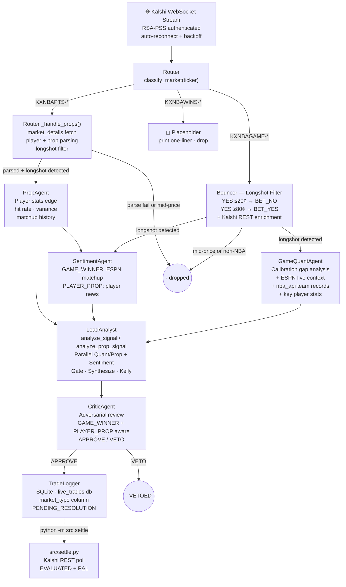

# p2p-trade-bot

Team 09
Jacob Huynh (sff8qc), Henry Chen (cqd3uk), Haoxuan Luo (ayr7tb)
Setup instructions can be found under the Setup & Installation, Configuration, and Running the Bot sections below.
Video Link: https://youtu.be/l5mNaxWArlU

## Description

A multi-agent prediction-market trading bot that exploits **longshot bias** in Kalshi NBA markets. The bot streams live trades from the Kalshi WebSocket, identifies mispriced contracts using historical calibration analysis and live player/team statistics, and routes them through dedicated LLM agent pipelines before logging approved mock trades to SQLite.

Both market types run through the **same full pipeline**:
- **GAME_WINNER (KXNBAGAME)** — longshot filter → GameQuantAgent + SentimentAgent (parallel) → LeadAnalyst → CriticAgent → log
- **PLAYER_PROP (KXNBAPTS)** — prop parser → PropAgent + SentimentAgent (parallel) → LeadAnalyst → CriticAgent → log

---

## The Edge: Longshot Bias in NBA Prediction Markets

Retail bettors systematically overprice YES underdogs on NBA game-winner markets. A team priced at 14¢ (implied 14% win probability) might only win 8% of the time historically — a **6pp calibration gap** that a contrarian BET_NO exploits over many trades.

The bot measures this gap as:

```
calibration_gap = actual_win_rate_at_price − implied_probability
```

All math is computed in Python from a local DuckDB database of historical Kalshi parquet data. The LLM agents evaluate signal quality and enforce risk management — they don't do arithmetic.

For player props, the edge is measured differently: comparing the player's recent hit rate and rolling average against the Kalshi prop line, with variance-adjusted Kelly sizing.

---

## Agent Architecture


```mermaid
flowchart TD
    WS["🌐 Kalshi WebSocket Stream<br/>RSA-PSS authenticated<br/>auto-reconnect + backoff"]
    ROUTER["Router<br/>classify_market(ticker)"]
    BOUNCER["Bouncer — Longshot Filter<br/>YES ≤20¢ → BET_NO<br/>YES ≥80¢ → BET_YES<br/>+ Kalshi REST enrichment"]
    PROPPARSE["Router _handle_props()<br/>market_details fetch<br/>player + prop parsing<br/>longshot filter"]
    QUANT["GameQuantAgent<br/>Calibration gap analysis<br/>+ ESPN live context<br/>+ nba_api team records<br/>+ key player stats"]
    PROPA["PropAgent<br/>Player stats edge<br/>hit rate · variance<br/>matchup history"]
    SENTIMENT["SentimentAgent<br/>GAME_WINNER: ESPN matchup<br/>PLAYER_PROP: player news"]
    ORCH["LeadAnalyst<br/>analyze_signal / analyze_prop_signal<br/>Parallel Quant/Prop + Sentiment<br/>Gate · Synthesize · Kelly"]
    CRITIC["CriticAgent<br/>Adversarial review<br/>GAME_WINNER + PLAYER_PROP aware<br/>APPROVE / VETO"]
    LOGGER["TradeLogger<br/>SQLite · live_trades.db<br/>market_type column<br/>PENDING_RESOLUTION"]
    SETTLE["src/settle.py<br/>Kalshi REST poll<br/>EVALUATED + P&L"]
    PLACEHOLDER["◻ Placeholder<br/>print one-liner · drop"]
    DROPPED(("· dropped"))
    VETOD(("· VETOED"))

    WS --> ROUTER
    ROUTER -->|"KXNBAGAME-*"| BOUNCER
    ROUTER -->|"KXNBAPTS-*"| PROPPARSE
    ROUTER -->|"KXNBAWINS-*"| PLACEHOLDER
    BOUNCER -->|longshot detected| QUANT
    BOUNCER -->|longshot detected| SENTIMENT
    BOUNCER -->|mid-price or non-NBA| DROPPED
    PROPPARSE -->|parsed + longshot detected| PROPA
    PROPPARSE -->|parse fail or mid-price| DROPPED
    PROPA --> SENTIMENT
    QUANT --> ORCH
    SENTIMENT --> ORCH
    PROPA --> ORCH
    ORCH --> CRITIC
    CRITIC -->|APPROVE| LOGGER
    CRITIC -->|VETO| VETOD
    LOGGER -. "python -m src.settle" .-> SETTLE
```

---

## Project Structure

```
p2p-trade-bot/
├── mock_database_setup.py    # Generate mock historical parquet data
├── requirements.txt
│
├── scripts/
│   └── verify_sentiment.py   # Test ESPN tool + sentiment agent end-to-end
│
├── src/
│   ├── config.py             # Env var config (PAPER_STARTING_CASH, etc.)
│   ├── settle.py             # Kalshi REST-based trade resolution CLI
│   │
│   ├── agents/
│   │   ├── orchestrator.py      # LeadAnalyst — parallel Quant+Sentiment synthesis
│   │   ├── game_quant_agent.py  # QuantAgent — calibration gap + team/player context
│   │   ├── prop_agent.py        # PlayerPropAgent — stats-based edge for player props
│   │   ├── sentiment_agent.py   # SentimentAgent — ESPN context (GAME_WINNER + PLAYER_PROP)
│   │   ├── critic.py            # CriticAgent — adversarial APPROVE/VETO
│   │   └── researcher.py        # ResearchAgent — unused placeholder
│   │
│   ├── pipeline/
│   │   ├── router.py            # Ticker classifier + market dispatcher
│   │   ├── bouncer.py           # Longshot filter + REST enrichment
│   │   └── websocket_client.py  # Async Kalshi WebSocket stream
│   │
│   ├── execution/
│   │   ├── trade_logger.py      # SQLite trade log (PENDING_RESOLUTION → EVALUATED)
│   │   └── trade_manager.py     # PaperTradeManager — position book + CSV logs
│   │
│   ├── report_trades.py         # CLI: report evaluated trades, bankroll, and market stats
│   │
│   └── tools/
│       ├── kalshi_rest.py        # Kalshi REST API (RSA-PSS auth)
│       ├── duckdb_tool.py        # Historical parquet queries
│       ├── espn_tool.py          # ESPN scoreboard API
│       ├── nba_team_tool.py      # nba_api team W/L records (GAME_WINNER)
│       ├── nba_player_stats_tool.py  # nba_api player stats (props + H2H key players)
│       └── news_tool.py          # News integration (placeholder)
│
├── data/
│   ├── kalshi/
│   │   ├── markets/*.parquet # Historical market data (mock or real)
│   │   └── trades/*.parquet  # Historical trade data (mock or real)
│   └── live_trades.db        # SQLite — live mock trade log
│
└── tests/
    ├── test_mock_pipeline.py # Mock end-to-end demo — 7 scenarios, no API keys needed
    ├── test_bouncer.py       # Bouncer filter unit tests
    ├── test_pipeline.py      # Full pipeline unit + integration tests (LLM mocked)
    ├── test_router.py        # Router classification + dispatch (no API keys)
    ├── test_espn_tool.py     # ESPN ticker parsing + live scoreboard API
    ├── test_nba_tool.py      # NBA ticker parsing + live nba_api
    ├── test_settle.py        # _determine_result() logic + run_settle() (live ESPN)
    └── test_websocket.py     # handle_message() routing + full pipeline (requires .env)
```

---

## Agents

### GameQuantAgent — `src/agents/game_quant_agent.py`

Measures the historical calibration gap at the current market price by querying the local parquet database. **All math is computed in Python** before the LLM is invoked; Claude writes a **3-sentence qualitative summary**.

**Input:** `trade_packet` (ticker, market_price, action)

**Process:**

1. Calls `get_price_bucket_edge(price, action)` — actual win rate vs. implied probability across all finalized NBA markets at this exact price
2. Calls `get_longshot_bias_stats(price)` — aggregate NO win rate for YES longshots ≤ this price
3. Fetches ESPN live game context via `espn_tool.find_game(ticker)` — game status, current score, winner if final
4. Fetches team W/L records via `nba_team_tool.get_team_recent_records(ticker)` — last 10 games for each team
5. Fetches key player stats via `nba_player_stats_tool.get_team_key_players(abbr)` — top 3 scorers for each team (last 10 game avg + last 5 scoring trend)
6. Computes verdict in Python, asks LLM for 3-sentence summary (edge → context → risk)

**Verdict thresholds:**

| Verdict             | Condition                                    |
| ------------------- | -------------------------------------------- |
| `EDGE_CONFIRMED`    | calibration_gap > 2% AND sample_size ≥ 200   |
| `EDGE_WEAK`         | calibration_gap > 0.8% AND sample_size ≥ 100 |
| `NO_EDGE`           | calibration_gap ≤ 0.8%                       |
| `INSUFFICIENT_DATA` | sample_size < 100 or no data                 |

**Output:** `{calibration_gap, actual_win_rate, implied_prob, verdict, sample_size, summary, game_context, team_stats, home_key_players, away_key_players, ...}`

---

### PlayerPropAgent — `src/agents/prop_agent.py`

Stats-based edge analyzer for KXNBAPTS markets. **No historical parquet calibration data is used** — edge is measured entirely from recent player performance against the prop line. Kelly sizing is capped at 5% (vs. 15% for game winners) to reflect higher per-game variance.

**Input:** `trade_packet` (ticker, player_name, prop_type, prop_threshold, action)

**Process:**

1. Fetches last 10 games via `nba_player_stats_tool.get_player_recent_stats(player_name)`
2. Fetches usage rate and pace context via `nba_player_stats_tool.get_player_usage_rate(player_name)`
3. Fetches matchup history vs. opponent via `nba_player_stats_tool.get_player_matchup_history(player_name, opponent_abbr)` if opponent is known
4. Computes hit rate, rolling average, and variance in Python
5. Asks LLM for 3-sentence summary (trend → matchup → risk)

**Verdict thresholds:**

| Verdict             | Condition                          |
| ------------------- | ---------------------------------- |
| `EDGE_CONFIRMED`    | hit_rate > 65% (last N games)      |
| `EDGE_WEAK`         | hit_rate 55–65%                    |
| `NO_EDGE`           | hit_rate ≤ 55%                     |
| `INSUFFICIENT_DATA` | fewer than 5 games sampled         |

PropAgent is a **data provider**, not a final decision-maker — its output feeds into `LeadAnalyst.analyze_prop_signal()`, which gates, synthesizes, and forwards to the CriticAgent for APPROVE/VETO just like game winners.

**Output:** `{player_name, prop_type, prop_threshold, recent_avg, hit_rate, variance, edge, verdict, confidence, kelly_fraction, summary, matchup_context, usage_rate}`

> **Settlement:** `src/settle.py` resolves both GAME_WINNER and PLAYER_PROP trades via Kalshi REST — no manual intervention needed. The `result` field (`"yes"`/`"no"`) is returned directly by the API for all finalized market types.

---

### SentimentAgent — `src/agents/sentiment_agent.py`

Enriches trade packets with live ESPN context before the Orchestrator synthesizes. Handles both GAME_WINNER and PLAYER_PROP; TOTALS passes through unchanged.

**Input:** `trade_packet` (ticker, contract_type, + player_name for props)

**GAME_WINNER process:**
1. Calls `get_espn_matchup_context(ticker)` — fetches current game status + ESPN NBA news for both teams
2. Uses `claude-haiku-4-5` to generate a 2–4 sentence matchup summary (injuries, lineup, momentum)

**PLAYER_PROP process:**
1. Calls `get_nba_news(limit=30)` — fetches recent ESPN NBA headlines
2. Filters articles mentioning the player name (headline + description substring match)
3. Uses `claude-haiku-4-5` to generate a 2–4 sentence player-specific summary (injury/availability, usage changes, lineup context)

**Output:** `trade_packet` with `sentiment_context` field added (string or `None` if unavailable)

---

### LeadAnalyst (Orchestrator) — `src/agents/orchestrator.py`

Orchestrates both the GAME_WINNER and PLAYER_PROP pipelines. Runs the analysis agent and SentimentAgent in parallel, applies a Python-only gate, synthesizes a narrative, and forwards to the CriticAgent.

**Input:** `trade_packet`

**Two entry points:**

`analyze_signal(trade_packet)` — GAME_WINNER pipeline:
1. Runs `GameQuantAgent` + `SentimentAgent` in parallel via `ThreadPoolExecutor`
2. Python gate: PASS if calibration_gap ≤ 0 or sample_size < 200
3. Calls `_synthesize()` to merge quant + sentiment into a Critic-ready narrative
4. Forwards to `CriticAgent.review()`

`analyze_prop_signal(trade_packet)` — PLAYER_PROP pipeline:
1. Runs `PropAgent` + `SentimentAgent` in parallel via `ThreadPoolExecutor`
2. Python gate: PASS if hit_rate ≤ 0.50 or verdict == INSUFFICIENT_DATA
3. Calls `_synthesize_prop()` to merge prop stats + player news into a Critic-ready narrative
4. Maps prop metrics into `quant_summary` shape for Critic compatibility
5. Forwards to `CriticAgent.review()`

**Key thresholds:**

| Threshold                       | GAME_WINNER            | PLAYER_PROP          |
| ------------------------------- | ---------------------- | -------------------- |
| Strong edge (`HIGH` confidence) | calibration_gap ≥ 2%   | hit_rate > 65%       |
| Weak edge (`MEDIUM` confidence) | calibration_gap ≥ 0.8% | hit_rate 55–65%      |
| Gate: PASS threshold            | calibration_gap ≤ 0    | hit_rate ≤ 0.50      |
| Kelly fraction cap              | 15%                    | 5%                   |

**Output:** `{status: APPROVED/VETOED/PASS, confidence, edge, kelly_fraction, quant_summary, sentiment_context, critic, ...}`

---

### CriticAgent — `src/agents/critic.py`

Adversarial agent whose **only job is to find reasons to VETO**. Acts as the primary decision-maker for **both GAME_WINNER and PLAYER_PROP** trades (uses `claude-sonnet-4-6`). Before calling the LLM, it queries the SQLite database for open portfolio positions and passes correlated-exposure data into the prompt.

**Input:** `trade_packet` + `orchestrator_decision` (synthesized narrative + sentiment context)

**Failure modes hunted:**

| #   | Failure Mode                    | Example Trigger                                         |
| --- | ------------------------------- | ------------------------------------------------------- |
| 1   | YES/NO asymmetry misapplication | BET_NO on NO longshot when asymmetry is wrong direction |
| 2   | Suspicious data patterns        | `actual_win_rate == 1.0` across 7000+ samples           |
| 3   | Market type mismatch            | Historical data mixed across GAME/TOTALS/PROPS          |
| 4   | Kelly fraction concerns         | kelly > 10% on MEDIUM confidence                        |
| 5   | Recency / regime change         | Edge only present in 2023 season data                   |
| 6   | Liquidity trap                  | `open_interest < 500` or `volume == 0`                  |
| 7   | Portfolio concentration         | Same-game exposure already > $15                        |
| 8   | Player prop data quality        | hit_rate > 90%, n_games < 5 with EDGE_CONFIRMED, high variance relative to edge |
| 9   | Player prop Kelly breach        | kelly_fraction > 5% (prop cap is tighter than game-winner 15%) |

The Critic explicitly understands **longshot bias mechanics** — BET_NO on a cheap underdog YES is the core strategy, not a red flag. For player props, sentiment (injury news, usage changes) is weighted more heavily than in game-winner trades.

**Output:** `{decision: APPROVE/VETO, veto_reason, concerns[], risk_score, sentiment_note, summary}` merged into decision dict with final status `APPROVED` or `VETOED`

---

### ResearchAgent — `src/agents/researcher.py`

**Unused placeholder.** ESPN live news context is fully handled by `SentimentAgent`. This file is retained for reference but plays no role in the pipeline.

---

## Tools

### `src/tools/kalshi_rest.py`

Authenticated Kalshi REST API client. Signs requests with RSA-PSS using your private key.

**Key functions:** `get_market_details(ticker) → dict | None`, `get_orderbook(ticker) → dict | None`

- `get_market_details` returns `{title, market_type, rules_primary, open_interest, ...}` — used by the bouncer (GAME_WINNER) and router (PLAYER_PROP prop parsing)
- Returns `None` gracefully when credentials are missing

---

### `src/tools/duckdb_tool.py`

Four query functions against `data/kalshi/{markets,trades}/*.parquet`. All queries aggregate by **price bucket** across all finalized NBA markets — not by ticker — because live tickers won't appear in historical data.

| Function                                 | Returns                                                  |
| ---------------------------------------- | -------------------------------------------------------- |
| `get_price_bucket_edge(price, action)`   | `actual_win_rate`, `implied_prob`, `edge`, `sample_size` |
| `get_longshot_bias_stats(price_ceiling)` | `no_win_rate`, `avg_price`, `sample_size`                |
| `get_historical_win_rate(price)`         | `win_rate`, `sample_size`                                |
| `get_market_volume_stats(ticker)`        | `volume`, `volume_24h`, `open_interest`                  |

---

### `src/tools/espn_tool.py`

Wrapper around the ESPN hidden NBA scoreboard and news APIs.

**Key functions:**

- `get_nba_scoreboard(date=None) → list[dict]` — fetches all games for a date (YYYYMMDD) or today; returns `{home_abbr, away_abbr, status, home_score, away_score, winner_abbr, ...}`
- `find_game(ticker, search_days=2) → dict | None` — parses teams from KXNBAGAME ticker and finds the matching ESPN game in today's + recent scoreboards
- `get_nba_news(limit=20) → list[dict]` — fetches raw NBA feed articles from ESPN
- `get_espn_matchup_context(ticker) → str | None` — filters `get_nba_news()` to articles mentioning either team in the game; used by `SentimentAgent`

Used by `GameQuantAgent` for live game context and by `SentimentAgent` for news enrichment.

> **Note:** Team abbreviation mapping handles mismatches between Kalshi and ESPN conventions (e.g. `GSW` → `GS`, `NOP` → `NO`, `UTA` → `UTAH`). The ticker parser uses `{2,3}` character matching to correctly split adjacent 3-char team codes (e.g. `LACBOS` → `LAC` + `BOS`).

---

### `src/tools/nba_team_tool.py`

Lightweight `nba_api` wrapper that fetches recent W/L records for the two teams in a game-winner ticker. Used exclusively by `GameQuantAgent` for team-level momentum context.

**Key function:** `get_team_recent_records(ticker, last_n=10) → dict | None`

- Returns `{"home": {"abbr": "LAC", "last10": "7-3", "home_record": "4-1", "away_record": "3-2"}, "away": {...}}`
- Returns `None` gracefully on timeout or parse failure — never blocks the pipeline

---

### `src/tools/nba_player_stats_tool.py`

`nba_api` wrapper for player-level statistics. Used by both `PropAgent` (for player prop edge analysis) and `GameQuantAgent` (for key player context in head-to-head games).

**Functions:**

| Function | Description |
| --- | --- |
| `get_player_recent_stats(player_name, last_n=10)` | Last N game log: avg pts/reb/ast/min + per-game breakdown |
| `get_player_usage_rate(player_name)` | Season usage rate, true shooting %, pace context |
| `get_player_matchup_history(player_name, opponent_abbr, last_n=5)` | Avg pts/reb/ast in last N games vs. a specific opponent |
| `get_team_key_players(team_abbr, top_n=3)` | Top N scorers for a team: avg pts/reb/ast + last-5 scoring trend |

All calls return `None` on any failure — never block the pipeline.

---

## Pipeline Components

### Router — `src/pipeline/router.py`

Classifies every incoming Kalshi trade by ticker prefix and dispatches to the correct handler.

| Ticker Prefix                                               | Market Type       | Handler                                         |
| ----------------------------------------------------------- | ----------------- | ----------------------------------------------- |
| `KXNBAGAME-*`                                               | GAME_WINNER       | `bouncer.process_trade()` → full agent pipeline |
| `KXNBAPTS-*`, `KXNBASGPROP-*`                               | PLAYER_PROP       | `_handle_props()` → PropAgent pipeline          |
| `KXNBAWINS-*`                                               | TOTALS            | placeholder — prints one-liner, returns None    |
| `KXNBASPREAD-*`, `KXNBATOTAL-*`, `KXNBA1HTOTAL-*`, `KXNBA2D-*`, `KXNBA3D-*`, `KXNBASERIES-*` | UNKNOWN | silently dropped — no strategy implemented |
| anything else                                               | NON_NBA / UNKNOWN | silently dropped                                |

**Player prop parsing:** `_handle_props()` calls `get_market_details(ticker)` to fetch the market title, then applies `_parse_prop_from_market()` (regex over the title) to extract `player_name`, `prop_type` (PTS/REB/AST), and `prop_threshold`. Supported title patterns:

```
"{Player}: {N}+ points"                → (player, "PTS", N)   ← live Kalshi format
"Will {Player} score {N}+ points?"     → (player, "PTS", N)
"Will {Player} record {N}+ rebounds?"  → (player, "REB", N)
"Will {Player} record {N}+ assists?"   → (player, "AST", N)
```

Ticker format reference:

```
KXNBAGAME-{YYMONDD}{HOME}{AWAY}-{SIDE}              →  game winner
KXNBAWINS-{TEAM}-{SEASON}-T{THRESHOLD}               →  season totals
KXNBAPTS-{YYMONDD}{GAME}-{TEAM}{PLAYER}{NUM}-{STAT}  →  player points prop (live format)
```

> **WebSocket price field:** Kalshi's trade stream sends `yes_price_dollars` as a decimal string (e.g. `"0.1600"`). The router normalises this to integer cents before filtering.

---

### Bouncer — `src/pipeline/bouncer.py`

First real filter for GAME_WINNER markets. Detects longshot bias opportunities and enriches the trade packet with REST API metadata.

**Longshot detection:**

| Condition       | Action    | Rationale                                     |
| --------------- | --------- | --------------------------------------------- |
| YES price ≤ 20¢ | `BET_NO`  | YES underdog is overpriced; fade the optimism |
| YES price ≥ 80¢ | `BET_YES` | NO underdog is overpriced; fade the pessimism |
| 20¢ < YES < 80¢ | dropped   | No systematic longshot bias in this range     |

After passing the filter, calls `get_market_details(ticker)` to add `market_title`, `market_type`, and `rules_primary` to the trade packet. The same longshot filter is applied to player prop markets in the router before building the trade packet.

---

### WebSocket Client — `src/pipeline/websocket_client.py`

Async Kalshi WebSocket connection with RSA-PSS authentication. Subscribes to the `trade` channel and routes each incoming message through `router.route()`.

**Auto-reconnect:** The `run_forever()` method wraps the connection in an exponential backoff loop — starting at 1s, doubling each attempt, capping at 60s.

Both market types now use the same pipeline and produce the same structured output format.

**GAME_WINNER path** — for `APPROVED` trades, prints:
- Multi-angle quant stats (price bucket edge, taker win rate, longshot bias, inverse bucket)
- Key player stats for both teams (scoring average, last-5 scoring trend)
- ESPN matchup sentiment context
- Orchestrator confidence and Kelly fraction
- Critic risk score, veto reason (if any), concerns, and sentiment note

**PLAYER_PROP path** — for `APPROVED` trades, prints:
- Player name, prop type, threshold, and action
- Hit rate, recent average vs. line, edge, and variance
- Matchup history vs. opponent (if available)
- Player news sentiment context (injury/usage/lineup)
- Orchestrator confidence and Kelly fraction
- Critic risk score, veto reason (if any), concerns, and sentiment note

Both paths call `TradeLogger.log_trade()` to persist to SQLite with the correct `market_type`. `VETOED` and `PASS` outcomes are printed but not logged.

---

## Execution Layer

### PaperTradeManager — `src/execution/trade_manager.py`

File-backed paper trading simulator. Zero network calls — records simulated fills to local files under `data/paper/`.

**Files written:**

| File          | Description                                               |
| ------------- | --------------------------------------------------------- |
| `book.json`   | Current portfolio state: cash, open positions, realized P&L |
| `trades.csv`  | Append-only log of every simulated fill                   |
| `equity.csv`  | Append-only equity-curve snapshot after each trade        |

**Contract sizing:**
- `risk_fraction = min(kelly_fraction, 2%)` — never risks more than 2% of cash per trade
- `contracts = floor(cash × risk_fraction / cost_per_contract)`, capped at `PAPER_MAX_CONTRACTS`

---

### TradeLogger — `src/execution/trade_logger.py`

SQLite-backed trade log at `data/live_trades.db`. Stores both GAME_WINNER and PLAYER_PROP trades, distinguished by the `market_type` column. Runs safe schema migrations on startup so existing databases are upgraded without data loss.

**Trade lifecycle:**

```
log_trade()  →  status = PENDING_RESOLUTION
evaluate_trade()  →  status = EVALUATED
```

**Schema (key columns):**

| Column            | Description                                          |
| ----------------- | ---------------------------------------------------- |
| `ticker`          | Kalshi market ticker                                 |
| `market_type`     | `GAME_WINNER` or `PLAYER_PROP`                       |
| `player_name`     | Player name (PLAYER_PROP trades only)                |
| `prop_threshold`  | Numeric prop line (PLAYER_PROP trades only)          |
| `action`          | `BET_YES` or `BET_NO`                                |
| `yes_price`       | Market price at signal time (cents)                  |
| `contracts`       | Position size (from Kelly + stake)                   |
| `cost_usd`        | Total entry cost                                     |
| `calibration_gap` | Edge at time of trade (calibration gap or stat edge) |
| `sample_size`     | Historical trades at this price (GAME_WINNER only)   |
| `verdict`         | `EDGE_CONFIRMED` / `EDGE_WEAK`                       |
| `risk_score`      | Critic risk score 1–10 (GAME_WINNER only)            |
| `status`          | `PENDING_RESOLUTION` or `EVALUATED`                  |
| `result`          | `yes` or `no` once market finalizes                  |
| `pnl_usd`         | Hypothetical profit/loss                             |

**Query by market type:**

```bash
sqlite3 data/live_trades.db "SELECT ticker, market_type, player_name, action, yes_price, verdict, pnl_usd FROM live_trades;"
```

---

### Resolution — `src/settle.py`

Polls the Kalshi REST API for final market results and evaluates any `PENDING_RESOLUTION` trades.

```bash
python -m src.settle
```

**Process for each pending trade:**

1. Calls `kalshi_rest.get_market_details(ticker)` — fetches live market state
2. Skips if API unavailable or `status != "finalized"`
3. Reads `result` field directly (`"yes"` or `"no"`)
4. Calls `logger.evaluate_trade(id, result)` → sets `EVALUATED` with P&L

Works for both GAME_WINNER and PLAYER_PROP trades — as long as the Kalshi market is finalized, the result is read from the API directly.

For a quick summary of all evaluated trades, bankroll, and markets traded:

```bash
python -m src.report_trades
```

---

## Data Layer

### Historical Data (DuckDB + Parquet)

> **Note:** The historical Kalshi data currently used by this project is **mocked** (generated by `mock_database_setup.py`). Real Kalshi historical market and trade data is available at [jon-becker/prediction-market-analysis](https://github.com/jon-becker/prediction-market-analysis) — dropping those parquet files into `data/kalshi/` will replace the mock data with real calibration signal.

`data/kalshi/markets/*.parquet` — one row per finalized Kalshi market:
`ticker, status, result, volume, open_interest, last_price, ...`

`data/kalshi/trades/*.parquet` — one row per historical trade fill:
`ticker, yes_price, taker_side, ...`

**Generate mock data:**

```bash
python mock_database_setup.py
```

The mock generator produces realistic distributions with:

- Quadratic longshot bias decay within the 1–20¢ range for GAME_WINNER markets
- Season-aware bias erosion for player props (`2023: 1.0`, `2024: 0.75`, `2025: 0.45`)
- Zero systematic bias for TOTALS (efficiently priced)
- Liquidity variation: 8% of illiquid player prop markets have `open_interest < 500`

### Live Trade Log (SQLite)

`data/live_trades.db` — created automatically on first run.

```bash
# All trades
sqlite3 data/live_trades.db "SELECT ticker, market_type, action, yes_price, calibration_gap, status, pnl_usd FROM live_trades;"

# Game winner trades only
sqlite3 data/live_trades.db "SELECT * FROM live_trades WHERE market_type = 'GAME_WINNER';"

# Player prop trades only
sqlite3 data/live_trades.db "SELECT ticker, player_name, prop_threshold, verdict, pnl_usd FROM live_trades WHERE market_type = 'PLAYER_PROP';"
```

---

## Setup & Installation

```bash
# 1. Clone and create virtual environment
git clone <repo-url>
cd p2p-trade-bot
python -m venv .venv && source .venv/bin/activate

# 2. Install dependencies
pip install -r requirements.txt

# 3. Configure environment
cp .env.example .env
# Edit .env — see Configuration section below

# 4. Generate mock historical database
python mock_database_setup.py
# Creates data/kalshi/markets/ and data/kalshi/trades/ parquet files
```

---

## Configuration

Create a `.env` file in the project root:

```bash
# Required for LLM agents
ANTHROPIC_API_KEY=sk-ant-...

# Required for live WebSocket streaming + market enrichment
KALSHI_API_KEY_ID=your-api-key-id
KALSHI_PRIVATE_KEY_PATH=/path/to/kalshi_private_key.pem

# Optional — position sizing (shown with defaults)
PAPER_STARTING_CASH=1000.0
PAPER_MAX_CONTRACTS=20
```

| Variable                  | Required           | Description                                      |
| ------------------------- | ------------------ | ------------------------------------------------ |
| `ANTHROPIC_API_KEY`       | Yes                | Claude access for all agents                     |
| `KALSHI_API_KEY_ID`       | For live streaming | Kalshi API key UUID                              |
| `KALSHI_PRIVATE_KEY_PATH` | For live streaming | Absolute path to RSA private key `.pem`          |
| `PAPER_STARTING_CASH`     | No                 | Starting bankroll in dollars (default: `1000.0`) |
| `PAPER_MAX_CONTRACTS`     | No                 | Max contracts per trade (default: `20`)          |

> **Kalshi credentials are optional for testing.** When absent, market enrichment fields (`market_title`, `rules_primary`) are set to `"Unknown"` and the rest of the pipeline runs normally using only mock data.

---

## Running the Bot

```bash
# Stream live Kalshi trades through the full agent pipeline
# Approved signals are mock-logged to data/live_trades.db
python -m src.pipeline.websocket_client

# Check Kalshi REST for finalized market results and evaluate pending mock trades
python -m src.settle

# See what the full pipeline output looks like (no API keys needed)
python tests/test_mock_pipeline.py

# Run the full test suite (router, ESPN, NBA, settle — no API keys needed)
pytest tests/ --ignore=tests/test_websocket.py -v

# Run the websocket integration test (requires KALSHI + ANTHROPIC keys in .env)
pytest tests/test_websocket.py -v

# Run the live pipeline test (requires ANTHROPIC_API_KEY + real parquet data)
python tests/test_pipeline.py --live
```

---

## Tests

The test suite uses **real API calls** throughout — no stubs for ESPN, nba_api, DuckDB, or (in the websocket test) Claude and Kalshi. LLM calls are mocked only in the core pipeline unit tests so they can run without credentials.

```bash
# All tests except the websocket integration test (no API keys needed for most)
pytest tests/ --ignore=tests/test_websocket.py -v

# WebSocket integration test (requires .env with Anthropic + Kalshi keys)
pytest tests/test_websocket.py -v

# Full pipeline with real Claude (requires ANTHROPIC_API_KEY + real parquet data)
python tests/test_pipeline.py --live
```

### `tests/test_mock_pipeline.py` — Mock end-to-end demo (no API keys needed)

Simulates the full pipeline output for all 7 realistic scenarios using mocked external calls (Kalshi REST, nba_api, ESPN, Claude LLM). Produces the same formatted output as the live websocket bot. Run it to see what APPROVED, VETOED, and PASS decisions look like in practice.

```bash
python tests/test_mock_pipeline.py    # full printout
pytest tests/test_mock_pipeline.py -v -s
```

| Scenario | Market | Outcome | What it demonstrates |
| --- | --- | --- | --- |
| 1 | GAME_WINNER | ✅ APPROVED | 7pp calibration gap, 418 samples, key player stats, Critic approves |
| 2 | GAME_WINNER | 🚫 VETOED | win_rate=1.0 — Critic catches data contamination |
| 3 | GAME_WINNER | ⏭️ PASS | 55¢ mid-price — bouncer drops before pipeline runs |
| 4 | PLAYER_PROP | ✅ APPROVED | LeBron 25+ PTS, 80% hit rate, matchup history, Critic approves |
| 5 | PLAYER_PROP | 🚫 VETOED | 95% hit rate — Critic flags as implausibly consistent |
| 6 | PLAYER_PROP | ⏭️ PASS | 40% hit rate — Python gate stops it before Critic is called |
| 7 | Logger | DB check | Logs one of each type; verifies `market_type`, `player_name`, `prop_threshold` columns |

---

### `tests/test_bouncer.py` — Bouncer filter unit tests

| Test                             | What it verifies                                            |
| -------------------------------- | ----------------------------------------------------------- |
| `test_nba_longshot_yes_side`     | YES ≤ 20¢ → BET_NO packet returned                          |
| `test_nba_longshot_no_side`      | YES ≥ 80¢ → BET_YES packet returned                         |
| `test_nba_middle_price_rejected` | 50¢ NBA trade → None                                        |
| `test_non_nba_rejected`          | Non-NBA ticker → None without making REST call              |
| `test_empty_trade_rejected`      | Empty payload → None without crash                          |
| `test_rest_failure_handled`      | REST returns None → packet returned with `"Unknown"` fields |

### `tests/test_pipeline.py` — Full pipeline (LLM mocked, no API key needed)

| Test                                   | What it verifies                                                         |
| -------------------------------------- | ------------------------------------------------------------------------ |
| `test_bouncer_filters`                 | All bouncer filter paths                                                 |
| `test_quant_price_bucket_query`        | DuckDB price-bucket queries return correct schema and types              |
| `test_pipeline_approved`               | Full APPROVED path: quant edge → orchestrator READY → critic APPROVE     |
| `test_pipeline_vetoed_contamination`   | Critic VETOs on `win_rate == 1.0`                                        |
| `test_pipeline_vetoed_liquidity`       | Critic VETOs on zero volume                                              |
| `test_pipeline_pass_no_edge`           | Orchestrator PASSes on negative calibration gap                          |
| `test_pipeline_pass_insufficient_data` | Orchestrator PASSes on < 100 sample size                                 |
| `test_pipeline_weak_edge`              | Weak edge + small sample → LOW confidence → PASS (deterministic)         |
| `test_paper_trading_e2e`               | `log_trade()` → PENDING_RESOLUTION; `evaluate_trade()` → EVALUATED + P&L |
| `test_pipeline_live`                   | Full pipeline with real DuckDB + real Claude (requires `--live` flag)    |

### `tests/test_router.py` — Router classification + dispatch (no API keys)

| Test                                                       | What it verifies                                       |
| ---------------------------------------------------------- | ------------------------------------------------------ |
| `test_classify_kxnbagame` / `_kxnbawins` / `_kxnbasgprop`  | Correct market type returned for each ticker prefix    |
| `test_classify_non_nba` / `_unknown_nba`                   | Non-NBA and unrecognised NBA tickers handled           |
| `test_route_game_winner_calls_bouncer`                     | KXNBAGAME ticker → `bouncer.process_trade()` called    |
| `test_route_game_winner_midprice_returns_none`             | Bouncer returning None → `(GAME_WINNER, None)`         |
| `test_route_totals_no_bouncer` / `_player_prop_no_bouncer` | Placeholder market types don't reach bouncer           |
| `test_route_non_nba_silent_drop`                           | Non-NBA silently dropped                               |
| `test_route_uses_market_ticker_field` / `_ticker_field`    | Both `market_ticker` and `ticker` key formats accepted |

### `tests/test_espn_tool.py` — ESPN tool (real public API)

| Test group                     | What it verifies                                                                                         |
| ------------------------------ | -------------------------------------------------------------------------------------------------------- |
| Ticker parsing (7 tests)       | `_parse_ticker()` for valid tickers, non-NBA, malformed, missing date prefix                             |
| Abbreviation mapping (7 tests) | `_to_espn_abbr()` for mapped teams (GSW→GS, NOP→NO, UTA→UTAH) and passthrough                            |
| Live scoreboard (5 tests)      | `get_nba_scoreboard()` returns correct schema; future date → `[]`; STATUS_FINAL games have `winner_abbr` |
| Live find_game (3 tests)       | Fake/non-NBA/malformed tickers all return None gracefully                                                |

### `tests/test_nba_tool.py` — NBA team tool (real public nba_api)

| Test group               | What it verifies                                                                                                                |
| ------------------------ | ------------------------------------------------------------------------------------------------------------------------------- |
| Ticker parsing (8 tests) | `_parse_teams_from_ticker()` for valid tickers, KXNBAWINS, missing segments                                                     |
| Live nba_api (4 tests)   | Non-NBA and unknown team codes return None; real teams return correct `home`/`away` dict schema (or None on API unavailability) |

### `tests/test_settle.py` — Settlement module (mocked Kalshi REST, no keys needed)

| Test                                          | What it verifies                                                   |
| --------------------------------------------- | ------------------------------------------------------------------ |
| `test_run_settle_no_pending_trades`           | Empty DB → prints message, API never called                        |
| `test_run_settle_api_unavailable`             | `get_market_details` returns None → trade stays PENDING            |
| `test_run_settle_market_still_open`           | `status="open"` → trade stays PENDING                              |
| `test_run_settle_market_closed_not_finalized` | `status="closed"` → trade stays PENDING                            |
| `test_run_settle_market_finalized_win`        | `status="finalized", result="no"` for BET_NO → EVALUATED, pnl > 0  |
| `test_run_settle_market_finalized_loss`       | `status="finalized", result="yes"` for BET_NO → EVALUATED, pnl < 0 |
| `test_run_settle_multiple_mixed`              | One finalized WIN + one open → 1 evaluated, 1 still PENDING        |
| `test_run_settle_unrecognised_result`         | `result="void"` (unexpected string) → stays PENDING                |

### `tests/test_websocket.py` — WebSocket client (requires `.env`)

Requires `KALSHI_API_KEY_ID` + `KALSHI_PRIVATE_KEY_PATH`. The full pipeline test additionally requires `ANTHROPIC_API_KEY`. Tests skip automatically if credentials are absent.

| Test                                             | What it verifies                                                                              |
| ------------------------------------------------ | --------------------------------------------------------------------------------------------- |
| `test_auth_headers_structure`                    | `_generate_auth_headers()` returns all three required Kalshi headers                          |
| `test_handle_non_trade_message_ignored`          | `type != "trade"` → analyst never called                                                      |
| `test_handle_totals_message_no_pipeline`         | KXNBAWINS ticker → analyst never called                                                       |
| `test_handle_mid_price_game_winner_no_pipeline`  | 55¢ KXNBAGAME → bouncer filters, analyst never called                                         |
| `test_handle_game_winner_longshot_full_pipeline` | Real 14¢ longshot signal through full real pipeline; APPROVED trades land in temp SQLite only |

## Future Roadmap & Architecture Plans

### 1. Core Data Engine: Sharp Book Integration

- **Market Consensus Baseline:** Upgrade all pipelines to ingest live odds from sharp traditional sportsbooks (e.g., Pinnacle, DraftKings) via an external odds API.
- **The Mathematical Edge:** Evolve the GameQuantAgent from purely analyzing historical calibration gaps to calculating the real-time edge between Kalshi's implied probability and the sharp consensus market.

### 2. Player Prop Settlement Automation

- **Status:** Player prop trades are logged correctly with `market_type = 'PLAYER_PROP'` and can be resolved via `src/settle.py` once the Kalshi market finalizes. Direct box score resolution (fetching stat lines from ESPN or nba_api to settle without waiting for Kalshi) is not yet implemented.
- **Next Steps:** Add a `settle_props()` path that queries the nba_api game log for the player's actual stat line on the trade date and auto-evaluates matching `PENDING_RESOLUTION` prop trades.

### 3. Build Out Totals Pipeline

- **Status:** Season win-total markets (KXNBAWINS) are classified but routed to a placeholder that prints a one-liner and drops the trade.
- **Next Steps:** Implement logic to weigh pace of play, offensive/defensive ratings (via `nba_api`), back-to-backs, and travel fatigue against the consensus line.

### 4. Granular P&L Reporting by Market Type

- **Status:** `src/report_trades.py` aggregates P&L across all evaluated trades. The `market_type` column is now present in `live_trades.db`.
- **Next Steps:** Update `report_trades.py` to break down win rate, ROI, and total P&L independently by `GAME_WINNER` vs. `PLAYER_PROP` to evaluate which pipeline generates more consistent edge.
