# p2p-trade-bot

A multi-agent prediction-market trading bot that exploits **longshot bias** in Kalshi NBA markets. The bot streams live trades from the Kalshi WebSocket, identifies mispriced NBA game-winner contracts using historical calibration analysis, and routes them through a three-stage LLM agent pipeline before logging approved mock trades to SQLite.

---

## The Edge: Longshot Bias in NBA Prediction Markets

Retail bettors systematically overprice YES underdogs on NBA game-winner markets. A team priced at 14¢ (implied 14% win probability) might only win 8% of the time historically — a **6pp calibration gap** that a contrarian BET_NO exploits over many trades.

The bot measures this gap as:

```
calibration_gap = actual_win_rate_at_price − implied_probability
```

All math is computed in Python from a local DuckDB database of historical Kalshi parquet data. The LLM agents evaluate signal quality and enforce risk management — they don't do arithmetic.

---

## Agent Architecture

```mermaid
flowchart TD
    WS["🌐 Kalshi WebSocket Stream\nRSA-PSS authenticated"]
    ROUTER["Router\nclassify_market(ticker)"]
    BOUNCER["Bouncer\nLongshot Filter\nYES ≤20¢ → BET_NO\nYES ≥80¢ → BET_YES\n+ REST Enrichment"]
    QUANT["QuantAgent\nCalibration Gap Analysis\n+ ESPN live context\n+ nba_api team records\n(LLM writes summary only)"]
    RESEARCH["[Research Agent]\nTODO: news · injuries\nline movement"]
    ORCH["LeadAnalyst\nSynthesize → Trade Proposal\nREADY / PASS\nKelly fraction ≤ 15%"]
    CRITIC["CriticAgent\nAdversarial Review\nQueries open portfolio\nAPPROVE / VETO"]
    LOGGER["TradeLogger\nSQLite · data/live_trades.db\nstatus = PENDING_RESOLUTION"]
    SETTLE["src/settle.py\nESPN scoreboard poll\nstatus = EVALUATED + P&L"]
    PLACEHOLDER["◻ Placeholder\nprint one-liner · drop"]
    DROPPED(("· dropped"))
    PASSD(("· PASS"))
    VETOD(("· VETOED"))

    WS --> ROUTER
    ROUTER -->|"KXNBAGAME-*"| BOUNCER
    ROUTER -->|"KXNBAWINS-* / KXNBASGPROP-*"| PLACEHOLDER
    BOUNCER -->|longshot detected| QUANT
    BOUNCER -->|mid-price or non-NBA| DROPPED
    QUANT --> ORCH
    RESEARCH -. "not yet implemented" .-> ORCH
    ORCH -->|READY| CRITIC
    ORCH -->|PASS| PASSD
    CRITIC -->|APPROVE| LOGGER
    CRITIC -->|VETO| VETOD
    LOGGER -. "python -m src.settle" .-> SETTLE
```



---

## Project Structure

```
p2p-trade-bot/
├── mock_database_setup.py    # Generate mock historical parquet data
├── requirements.txt
│
├── src/
│   ├── config.py             # Env var config (PAPER_STARTING_CASH, etc.)
│   ├── settle.py             # ESPN-based trade resolution CLI
│   │
│   ├── agents/
│   │   ├── orchestrator.py   # LeadAnalyst — synthesize → READY/PASS
│   │   ├── quant.py          # QuantAgent — calibration gap analysis
│   │   ├── critic.py         # CriticAgent — adversarial APPROVE/VETO
│   │   └── researcher.py     # ResearchAgent — placeholder
│   │
│   ├── pipeline/
│   │   ├── router.py         # Ticker classifier + market dispatcher
│   │   ├── bouncer.py        # Longshot filter + REST enrichment
│   │   └── websocket_client.py  # Async Kalshi WebSocket stream
│   │
│   ├── execution/
│   │   └── trade_logger.py   # SQLite trade log (PENDING_RESOLUTION → EVALUATED)
│   │
│   └── tools/
│       ├── kalshi_rest.py    # Kalshi REST API (RSA-PSS auth)
│       ├── duckdb_tool.py    # Historical parquet queries
│       ├── espn_tool.py      # ESPN scoreboard API
│       ├── nba_tool.py       # nba_api team stats
│       └── news_tool.py      # News integration (placeholder)
│
├── data/
│   ├── kalshi/
│   │   ├── markets/*.parquet # Historical market data (mock or real)
│   │   └── trades/*.parquet  # Historical trade data (mock or real)
│   └── live_trades.db        # SQLite — live mock trade log
│
└── tests/
    ├── test_bouncer.py       # Bouncer filter unit tests
    ├── test_pipeline.py      # Full pipeline unit + integration tests (LLM mocked)
    ├── test_router.py        # Router classification + dispatch (no API keys)
    ├── test_espn_tool.py     # ESPN ticker parsing + live scoreboard API
    ├── test_nba_tool.py      # NBA ticker parsing + live nba_api
    ├── test_settle.py        # _determine_result() logic + run_settle() (live ESPN)
    └── test_websocket.py     # handle_message() routing + full pipeline (requires .env)
```

---

## Agents

### QuantAgent — `src/agents/quant.py`

Measures the historical calibration gap at the current market price by querying the local parquet database. **All math is computed in Python** before the LLM is invoked; Claude only writes a qualitative one-sentence summary.

**Input:** `trade_packet` (ticker, market_price, action)

**Process:**

1. Calls `get_price_bucket_edge(price, action)` — actual win rate vs. implied probability across all finalized NBA markets at this exact price
2. Calls `get_longshot_bias_stats(price)` — aggregate NO win rate for YES longshots ≤ this price
3. Fetches ESPN live game context via `espn_tool.find_game(ticker)` — game status, current score, winner if final
4. Fetches recent W/L records via `nba_tool.get_team_recent_records(ticker)` — last 10 games for each team
5. Computes verdict in Python, asks LLM for summary sentence

**Verdict thresholds:**

| Verdict             | Condition                                    |
| ------------------- | -------------------------------------------- |
| `EDGE_CONFIRMED`    | calibration_gap > 2% AND sample_size ≥ 200   |
| `EDGE_WEAK`         | calibration_gap > 0.8% AND sample_size ≥ 100 |
| `NO_EDGE`           | calibration_gap ≤ 0.8%                       |
| `INSUFFICIENT_DATA` | sample_size < 100 or no data                 |

**Output:** `{calibration_gap, actual_win_rate, implied_prob, verdict, sample_size, summary, game_context, team_stats, ...}`

---

### LeadAnalyst (Orchestrator) — `src/agents/orchestrator.py`

Synthesizes the quant report and (eventually) the research report into a binary **READY / PASS** trade proposal. Also computes position sizing via the Kelly criterion.

**Input:** `trade_packet` + `quant_report`

**Process:**

1. Receives quant report with pre-computed calibration gap
2. Computes `confidence` (HIGH / MEDIUM / LOW) and `kelly_fraction` (capped at 15%)
3. Passes a structured `[Research Agent placeholder]` comment — when `ResearchAgent` is implemented, its output slots in here
4. Calls Claude with the full quant report + research section; receives READY or PASS

**Key thresholds:**

| Threshold                       | Value                  |
| ------------------------------- | ---------------------- |
| Strong edge (`HIGH` confidence) | calibration_gap ≥ 2%   |
| Weak edge (`MEDIUM` confidence) | calibration_gap ≥ 0.8% |
| Min sample size                 | 200 trades             |
| Kelly fraction cap              | 15%                    |

**Output:** `{status: READY/PASS, reason, confidence, edge, kelly_fraction, ...}`

---

### CriticAgent — `src/agents/critic.py`

Adversarial agent whose **only job is to find reasons to VETO**. Before calling the LLM, it queries the SQLite database for open portfolio positions and passes the correlated-exposure data into the prompt.

**Input:** `trade_packet` + `orchestrator_decision` (only called on READY)

**Seven failure modes hunted:**

| #   | Failure Mode                    | Example Trigger                                         |
| --- | ------------------------------- | ------------------------------------------------------- |
| 1   | YES/NO asymmetry misapplication | BET_NO on NO longshot when asymmetry is wrong direction |
| 2   | Suspicious data patterns        | `actual_win_rate == 1.0` across 7000+ samples           |
| 3   | Market type mismatch            | Historical data mixed across GAME/TOTALS/PROPS          |
| 4   | Kelly fraction concerns         | kelly > 10% on MEDIUM confidence                        |
| 5   | Recency / regime change         | Edge only present in 2023 season data                   |
| 6   | Liquidity trap                  | `open_interest < 500` or `volume == 0`                  |
| 7   | Portfolio concentration         | Same-game exposure already > $15                        |

**Output:** `{decision: APPROVE/VETO, veto_reason, concerns[], risk_score, summary}` merged into decision dict with final status `APPROVED` or `VETOED`

---

### ResearchAgent — `src/agents/researcher.py`

**Placeholder — not yet implemented.** When built, this agent will ingest news headlines, injury reports, and line-movement signals for the relevant game, returning a structured report that the orchestrator uses to upgrade or downgrade its trade proposal.

---

## Tools

### `src/tools/kalshi_rest.py`

Authenticated Kalshi REST API client. Signs requests with RSA-PSS using your private key.

**Key function:** `get_market_details(ticker) → dict | None`

- Returns `{title, market_type, rules_primary, ...}` for market enrichment in the bouncer
- Returns `None` gracefully when credentials are missing (rest of pipeline continues with `"Unknown"` fields)

---

### `src/tools/duckdb_tool.py`

Four query functions against `data/kalshi/{markets,trades}/*.parquet`. All queries aggregate by **price bucket** across all finalized NBA markets — not by ticker — because live tickers won't appear in historical data.

| Function                                 | Returns                                                  |
| ---------------------------------------- | -------------------------------------------------------- |
| `get_price_bucket_edge(price, action)`   | `actual_win_rate`, `implied_prob`, `edge`, `sample_size` |
| `get_longshot_bias_stats(price_ceiling)` | `no_win_rate`, `avg_price`, `sample_size`                |
| `get_historical_win_rate(price)`         | `win_rate`, `sample_size`                                |
| `get_market_volume_stats(ticker)`        | `volume`, `volume_24h`, `open_interest`                  |

---

### `src/tools/espn_tool.py`

Wrapper around the ESPN hidden NBA scoreboard API.

**Key functions:**

- `get_nba_scoreboard(date=None) → list[dict]` — fetches all games for a date (YYYYMMDD) or today; returns `{home_abbr, away_abbr, status, home_score, away_score, winner_abbr, ...}`
- `find_game(ticker, search_days=2) → dict | None` — parses teams from KXNBAGAME ticker and finds the matching ESPN game in today's + recent scoreboards

Used by `QuantAgent` for live context and by `src/settle.py` for resolution.

> **Note:** Team abbreviation mapping handles mismatches between Kalshi and ESPN conventions (e.g. `GSW` → `GS`, `NOP` → `NO`, `UTA` → `UTAH`). The ticker parser uses `{2,3}` character matching to correctly split adjacent 3-char team codes (e.g. `LACBOS` → `LAC` + `BOS`).

---

### `src/tools/nba_tool.py`

Lightweight `nba_api` wrapper that fetches recent W/L records for the two teams in a game-winner ticker.

**Key function:** `get_team_recent_records(ticker, last_n=10) → dict | None`

- Returns `{"home": {"abbr": "LAC", "last10": "7-3", ...}, "away": {...}}`
- Returns `None` gracefully on timeout or parse failure — never blocks the pipeline

---

## Pipeline Components

### Router — `src/pipeline/router.py`

Classifies every incoming Kalshi trade by ticker prefix and dispatches to the correct handler.

| Ticker Prefix   | Market Type       | Handler                                         |
| --------------- | ----------------- | ----------------------------------------------- |
| `KXNBAGAME-*`   | GAME_WINNER       | `bouncer.process_trade()` → full agent pipeline |
| `KXNBAWINS-*`   | TOTALS            | placeholder — prints one-liner, returns None    |
| `KXNBASGPROP-*` | PLAYER_PROP       | placeholder — prints one-liner, returns None    |
| anything else   | NON_NBA / UNKNOWN | silently dropped                                |

Ticker format reference:

```
KXNBAGAME-{YYMONDD}{HOME}{AWAY}-{SIDE}    →  game winner
KXNBAWINS-{TEAM}-{SEASON}-T{THRESHOLD}    →  season totals
KXNBASGPROP-{YYMONDD}{PLAYER}-{STAT}{N}   →  player prop
```

---

### Bouncer — `src/pipeline/bouncer.py`

First real filter for GAME_WINNER markets. Detects longshot bias opportunities and enriches the trade packet with REST API metadata.

**Longshot detection:**

| Condition       | Action    | Rationale                                     |
| --------------- | --------- | --------------------------------------------- |
| YES price ≤ 20¢ | `BET_NO`  | YES underdog is overpriced; fade the optimism |
| YES price ≥ 80¢ | `BET_YES` | NO underdog is overpriced; fade the pessimism |
| 20¢ < YES < 80¢ | dropped   | No systematic longshot bias in this range     |

After passing the filter, calls `get_market_details(ticker)` to add `market_title`, `market_type`, and `rules_primary` to the trade packet.

---

### WebSocket Client — `src/pipeline/websocket_client.py`

Async Kalshi WebSocket connection with RSA-PSS authentication. Subscribes to the `trade` channel and routes each incoming message through `router.route()`.

For `APPROVED` trades, prints the full pipeline decision (quant stats, orchestrator confidence, critic risk score) and calls `TradeLogger.log_trade()` to persist to SQLite.

---

## Execution Layer

### TradeLogger — `src/execution/trade_logger.py`

SQLite-backed trade log at `data/live_trades.db`.

**Trade lifecycle:**

```
log_trade()  →  status = PENDING_RESOLUTION
evaluate_trade()  →  status = EVALUATED
```

**Schema (key columns):**

| Column            | Description                         |
| ----------------- | ----------------------------------- |
| `ticker`          | Kalshi market ticker                |
| `action`          | `BET_YES` or `BET_NO`               |
| `yes_price`       | Market price at signal time (cents) |
| `contracts`       | Position size (from Kelly + stake)  |
| `cost_usd`        | Total entry cost                    |
| `calibration_gap` | Edge at time of trade               |
| `sample_size`     | Historical trades at this price     |
| `verdict`         | `EDGE_CONFIRMED` / `EDGE_WEAK`      |
| `risk_score`      | Critic risk score (1–10)            |
| `status`          | `PENDING_RESOLUTION` or `EVALUATED` |
| `result`          | `yes` or `no` once game finishes    |
| `pnl_usd`         | Hypothetical profit/loss            |

---

### Resolution — `src/settle.py`

Polls ESPN for final game results and evaluates any `PENDING_RESOLUTION` trades.

```bash
python -m src.settle
```

**Process for each pending trade:**

1. Calls `espn_tool.find_game(ticker, search_days=3)` — searches today + 2 prior days
2. Skips if no ESPN match or game not `STATUS_FINAL`
3. Determines winner from home/away abbreviations
4. Calls `logger.evaluate_trade(id, result)` → sets `EVALUATED` with P&L

---

## Data Layer

### Historical Data (DuckDB + Parquet)

`data/kalshi/markets/*.parquet` — one row per finalized Kalshi market:
`ticker, status, result, volume, open_interest, last_price, ...`

`data/kalshi/trades/*.parquet` — one row per historical trade fill:
`ticker, yes_price, taker_side, ...`

**Generate mock data:**

```bash
python mock_database_setup.py
```

The mock generator produces realistic distributions with:

- Quadratic longshot bias decay within the 1–20¢ range for GAME_WINNER markets
- Season-aware bias erosion for player props (`2023: 1.0`, `2024: 0.75`, `2025: 0.45`)
- Zero systematic bias for TOTALS (efficiently priced)
- Liquidity variation: 8% of illiquid player prop markets have `open_interest < 500`

### Live Trade Log (SQLite)

`data/live_trades.db` — created automatically on first run. Query it directly:

```bash
sqlite3 data/live_trades.db "SELECT ticker, action, yes_price, calibration_gap, status, pnl_usd FROM live_trades;"
```

---

## Setup & Installation

```bash
# 1. Clone and create virtual environment
git clone <repo-url>
cd p2p-trade-bot
python -m venv .venv && source .venv/bin/activate

# 2. Install dependencies
pip install -r requirements.txt

# 3. Configure environment
cp .env.example .env
# Edit .env — see Configuration section below

# 4. Generate mock historical database
python mock_database_setup.py
# Creates data/kalshi/markets/ and data/kalshi/trades/ parquet files
```

---

## Configuration

Create a `.env` file in the project root:

```bash
# Required for LLM agents
ANTHROPIC_API_KEY=sk-ant-...

# Required for live WebSocket streaming + market enrichment
KALSHI_API_KEY_ID=your-api-key-id
KALSHI_PRIVATE_KEY_PATH=/path/to/kalshi_private_key.pem

# Optional — position sizing (shown with defaults)
PAPER_STARTING_CASH=1000.0
PAPER_MAX_CONTRACTS=20
```

| Variable                  | Required           | Description                                      |
| ------------------------- | ------------------ | ------------------------------------------------ |
| `ANTHROPIC_API_KEY`       | Yes                | Claude Sonnet 4.6 access for all three agents    |
| `KALSHI_API_KEY_ID`       | For live streaming | Kalshi API key UUID                              |
| `KALSHI_PRIVATE_KEY_PATH` | For live streaming | Absolute path to RSA private key `.pem`          |
| `PAPER_STARTING_CASH`     | No                 | Starting bankroll in dollars (default: `1000.0`) |
| `PAPER_MAX_CONTRACTS`     | No                 | Max contracts per trade (default: `20`)          |

> **Kalshi credentials are optional for testing.** When absent, market enrichment fields (`market_title`, `rules_primary`) are set to `"Unknown"` and the rest of the pipeline runs normally using only mock data.

---

## Running the Bot

```bash
# Stream live Kalshi trades through the full agent pipeline
# Approved signals are mock-logged to data/live_trades.db
python -m src.pipeline.websocket_client

# Check ESPN for game results and evaluate any pending mock trades
python -m src.settle

# Run the full test suite (router, ESPN, NBA, settle — no API keys needed)
pytest tests/ --ignore=tests/test_websocket.py -v

# Run the websocket integration test (requires KALSHI + ANTHROPIC keys in .env)
pytest tests/test_websocket.py -v

# Run the live pipeline test (requires ANTHROPIC_API_KEY + real parquet data)
python tests/test_pipeline.py --live
```

---

## Tests

The test suite uses **real API calls** throughout — no stubs for ESPN, nba_api, DuckDB, or (in the websocket test) Claude and Kalshi. LLM calls are mocked only in the core pipeline unit tests so they can run without credentials.

```bash
# All tests except the websocket integration test (no API keys needed for most)
pytest tests/ --ignore=tests/test_websocket.py -v

# WebSocket integration test (requires .env with Anthropic + Kalshi keys)
pytest tests/test_websocket.py -v

# Full pipeline with real Claude (requires ANTHROPIC_API_KEY + real parquet data)
python tests/test_pipeline.py --live
```

### `tests/test_bouncer.py` — Bouncer filter unit tests

| Test                             | What it verifies                                            |
| -------------------------------- | ----------------------------------------------------------- |
| `test_nba_longshot_yes_side`     | YES ≤ 20¢ → BET_NO packet returned                          |
| `test_nba_longshot_no_side`      | YES ≥ 80¢ → BET_YES packet returned                         |
| `test_nba_middle_price_rejected` | 50¢ NBA trade → None                                        |
| `test_non_nba_rejected`          | Non-NBA ticker → None without making REST call              |
| `test_empty_trade_rejected`      | Empty payload → None without crash                          |
| `test_rest_failure_handled`      | REST returns None → packet returned with `"Unknown"` fields |

### `tests/test_pipeline.py` — Full pipeline (LLM mocked, no API key needed)

| Test                                   | What it verifies                                                         |
| -------------------------------------- | ------------------------------------------------------------------------ |
| `test_bouncer_filters`                 | All bouncer filter paths                                                 |
| `test_quant_price_bucket_query`        | DuckDB price-bucket queries return correct schema and types              |
| `test_pipeline_approved`               | Full APPROVED path: quant edge → orchestrator READY → critic APPROVE     |
| `test_pipeline_vetoed_contamination`   | Critic VETOs on `win_rate == 1.0`                                        |
| `test_pipeline_vetoed_liquidity`       | Critic VETOs on zero volume                                              |
| `test_pipeline_pass_no_edge`           | Orchestrator PASSes on negative calibration gap                          |
| `test_pipeline_pass_insufficient_data` | Orchestrator PASSes on < 100 sample size                                 |
| `test_pipeline_weak_edge`              | Weak edge + small sample → LOW confidence → PASS (deterministic)         |
| `test_paper_trading_e2e`               | `log_trade()` → PENDING_RESOLUTION; `evaluate_trade()` → EVALUATED + P&L |
| `test_pipeline_live`                   | Full pipeline with real DuckDB + real Claude (requires `--live` flag)    |

### `tests/test_router.py` — Router classification + dispatch (no API keys)

| Test                                                       | What it verifies                                       |
| ---------------------------------------------------------- | ------------------------------------------------------ |
| `test_classify_kxnbagame` / `_kxnbawins` / `_kxnbasgprop`  | Correct market type returned for each ticker prefix    |
| `test_classify_non_nba` / `_unknown_nba`                   | Non-NBA and unrecognised NBA tickers handled           |
| `test_route_game_winner_calls_bouncer`                     | KXNBAGAME ticker → `bouncer.process_trade()` called    |
| `test_route_game_winner_midprice_returns_none`             | Bouncer returning None → `(GAME_WINNER, None)`         |
| `test_route_totals_no_bouncer` / `_player_prop_no_bouncer` | Placeholder market types don't reach bouncer           |
| `test_route_non_nba_silent_drop`                           | Non-NBA silently dropped                               |
| `test_route_uses_market_ticker_field` / `_ticker_field`    | Both `market_ticker` and `ticker` key formats accepted |

### `tests/test_espn_tool.py` — ESPN tool (real public API)

| Test group                     | What it verifies                                                                                         |
| ------------------------------ | -------------------------------------------------------------------------------------------------------- |
| Ticker parsing (7 tests)       | `_parse_ticker()` for valid tickers, non-NBA, malformed, missing date prefix                             |
| Abbreviation mapping (7 tests) | `_to_espn_abbr()` for mapped teams (GSW→GS, NOP→NO, UTA→UTAH) and passthrough                            |
| Live scoreboard (5 tests)      | `get_nba_scoreboard()` returns correct schema; future date → `[]`; STATUS_FINAL games have `winner_abbr` |
| Live find_game (3 tests)       | Fake/non-NBA/malformed tickers all return None gracefully                                                |

### `tests/test_nba_tool.py` — NBA tool (real public nba_api)

| Test group               | What it verifies                                                                                                                |
| ------------------------ | ------------------------------------------------------------------------------------------------------------------------------- |
| Ticker parsing (8 tests) | `_parse_teams_from_ticker()` for valid tickers, KXNBAWINS, missing segments                                                     |
| Live nba_api (4 tests)   | Non-NBA and unknown team codes return None; real teams return correct `home`/`away` dict schema (or None on API unavailability) |

### `tests/test_settle.py` — Settlement module (real ESPN API + temp SQLite)

| Test                                                | What it verifies                                         |
| --------------------------------------------------- | -------------------------------------------------------- |
| `test_determine_result_home_wins`                   | Home team winner → `"yes"`                               |
| `test_determine_result_away_wins`                   | Away team winner → `"no"`                                |
| `test_determine_result_no_winner` / `_unknown_team` | Empty or mismatched winner → `None`                      |
| `test_determine_result_case_insensitive`            | Lowercase `winner_abbr` still matches                    |
| `test_run_settle_no_pending_trades`                 | Empty DB → prints message, no crash                      |
| `test_run_settle_fake_ticker_stays_pending`         | Fake ticker hits real ESPN, gets no match, stays PENDING |
| `test_run_settle_multiple_pending_all_fake`         | Multiple fake tickers all stay PENDING                   |

### `tests/test_websocket.py` — WebSocket client (requires `.env`)

Requires `KALSHI_API_KEY_ID` + `KALSHI_PRIVATE_KEY_PATH`. The full pipeline test additionally requires `ANTHROPIC_API_KEY`. Tests skip automatically if credentials are absent.

| Test                                             | What it verifies                                                                              |
| ------------------------------------------------ | --------------------------------------------------------------------------------------------- |
| `test_auth_headers_structure`                    | `_generate_auth_headers()` returns all three required Kalshi headers                          |
| `test_handle_non_trade_message_ignored`          | `type != "trade"` → analyst never called                                                      |
| `test_handle_totals_message_no_pipeline`         | KXNBAWINS ticker → analyst never called                                                       |
| `test_handle_mid_price_game_winner_no_pipeline`  | 55¢ KXNBAGAME → bouncer filters, analyst never called                                         |
| `test_handle_game_winner_longshot_full_pipeline` | Real 14¢ longshot signal through full real pipeline; APPROVED trades land in temp SQLite only |

## Future Roadmap & Architecture Plans

### 1. Core Data Engine: Sharp Book Integration

- **Market Consensus Baseline:** Upgrade all pipelines to ingest live odds from sharp traditional sportsbooks (e.g., Pinnacle, DraftKings) via an external odds API.
- **The Mathematical Edge:** Evolve the Quant Agent from purely analyzing historical calibration gaps to calculating the real-time edge between Kalshi's implied probability and the sharp consensus market.

### 2. Researcher Agent (Fundamental & News Analysis)

- **Status:** Currently a placeholder in `src/agents/researcher.py`.
- **Purpose:** To parse unstructured text for late-breaking news, injuries, and lineup changes that quantitative models and slow-moving sportsbooks miss.
- **Data Sources:** ESPN Hidden API (`/nba/news`) and Reddit API (PRAW) scraping `r/nba`.
- **Agentic Role:** Reads qualitative news, assesses severity, and outputs a structured probability modifier to the Orchestrator to adjust the baseline odds.

### 3. Build Out Totals & Player Props Pipelines

- **Status:** Currently routed in `src/pipeline/router.py` but drop out as placeholders.
- **Totals (Over/Under):** Implement logic to weigh pace of play, offensive/defensive ratings (via `nba_api`), back-to-backs, and travel fatigue against the consensus line.
- **Player Props:** Implement the Top-Down Market Consensus engine. Compare external consensus odds with Kalshi to identify stale lines, while using the Researcher Agent to adjust for usage rate shifts if a star player is unexpectedly scratched.

### 4. Granular Performance Tracking by Market Type

- **Status:** Basic mock execution and ESPN settlement (`src/settle.py`) are implemented.
- **Next Steps:** Update the `data/live_trades.db` SQLite schema to include a `market_type` column (`GAME_WINNER`, `TOTALS`, `PLAYER_PROP`).
- **Metrics:** Modify the settlement script to aggregate and track P&L, Win Rate, and ROI completely independently for each of the three market types to evaluate which pipelines are actually generating an edge.
